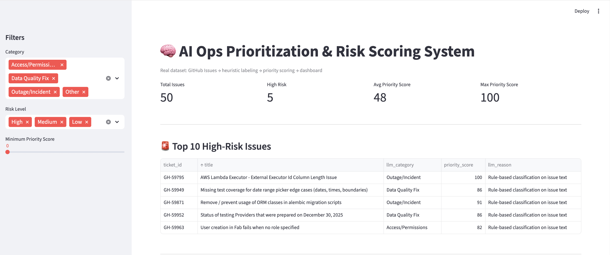
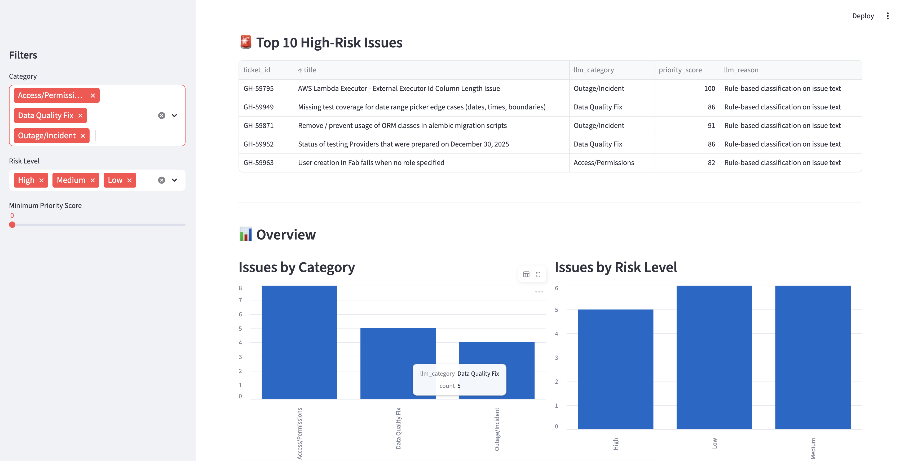
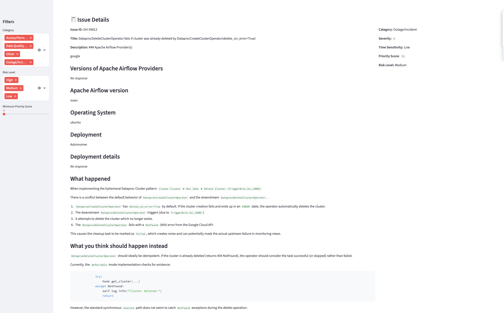

# AI Ops Prioritization & Risk Scoring System

A portfolio project that demonstrates how unstructured operational issues
(GitHub issues) can be converted into a prioritized, risk-aware backlog
using analytics logic and AI-style classification.

---

## Business Problem

Operations teams receive hundreds of issues, tickets, and requests.
All of them look “important”, but teams must decide:

**Which issues should be handled first — and why?**

This project simulates a real Ops / Analytics workflow:
- Raw issues → structured signals
- Signals → priority score
- Priority → executive-friendly dashboard

---

## What This Project Does

1. **Ingests real GitHub issues** from a public repository  
2. **Classifies issues** into operational categories  
3. **Assigns severity & urgency** using rule-based logic (LLM-ready design)  
4. **Calculates a priority score & risk level**  
5. **Visualizes results** in an interactive Streamlit dashboard  

---

## Tech Stack

- Python
- Pandas
- Streamlit
- GitHub Issues API
- Heuristic / AI-style labeling logic
- CSV-based analytics pipeline

> Note: Heuristic labeling is used instead of live LLM calls due to API rate limits.
> The code is structured so LLM-based classification can be plugged in easily.

---

## Project Flow

GitHub Issues
↓
Data Cleaning
↓
Issue Classification
↓
Risk & Priority Scoring
↓
Interactive Dashboard

 ---

## Dashboard Preview

### Overview

### Top High-Risk Issues

### Issue Details View

---

## Key Outputs

Each issue is enriched with:

- `llm_category` – type of operational issue
- `llm_severity` – impact level (1–5)
- `llm_time_sensitivity` – Low / Medium / High
- `priority_score` – numeric ranking (0–100)
- `risk_level` – High / Medium / Low
- `llm_reason` – explainable justification

---

## Validation (Manual QA)

To validate the model logic:

- 20 issues were manually labeled with a **risk level**
- Compared against model output

**Results**
- Matches: 10 / 20
- Match rate: **50%**

This is expected because:
- Risk perception varies by organization
- No SLA / revenue / customer-impact data was available
- Rules are intentionally simple and explainable

---

## What This Demonstrates (for Recruiters)

- Translating unstructured text into analytics-ready data
- Prioritization logic, not just dashboards
- Explainable scoring instead of black-box AI
- End-to-end ownership: data → logic → validation → UI

---

## Repository Structure
.
├── app.py # Streamlit dashboard
├── assets/ # Dashboard screenshots
├── data/ # Raw, labeled, and scored CSVs
├── src/
│ ├── fetch_github_issues.py
│ ├── heuristic_labeler.py
│ ├── risk_scoring.py
│ └── test_openai_call.py
├── requirements.txt
└── README.md

---

## How This Can Be Extended

- Replace heuristic rules with LLM-based classification
- Train a lightweight ML classifier using labeled data
- Add business signals (SLA breach, issue age, comments)
- Deploy dashboard publicly

